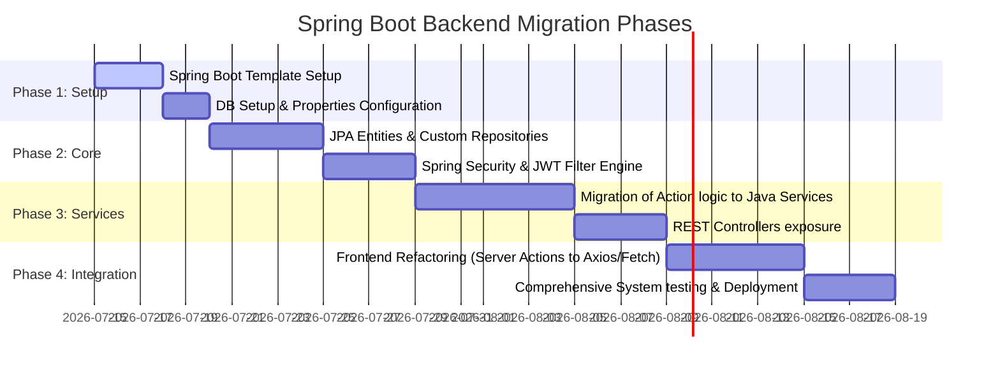

# Migration Blueprint: Porting Muhasabah to Java Spring Boot

This report details the migration strategy, package structure, entity mappings, security configurations, and dependency definitions required to transition the Muhasabah backend to Java Spring Boot.

---

## 1. Migration Architecture Strategy

To maintain Muhasabah's high-quality dashboard and visual design, we recommend a **Decoupled Backend Architecture**:
*   **Frontend (Next.js):** Remains the primary user interface layer, but instead of calling Next.js Server Actions directly, it sends standard async HTTP calls (`fetch`) to the Spring Boot REST API.
*   **Backend (Spring Boot):** Replaces the Next.js server actions. It manages authentication, coordinates database calls using Hibernate, runs routine validation, and exposes REST endpoints.

```text
[ Next.js Client App (Port 3000) ]
              │
              ▼ (REST HTTP Requests via Fetch + JWT Cookie)
[ Spring Boot Controller / Security Filter (Port 8080) ]
              │
              ▼ (Spring Data Service Layer)
[ Spring Data JPA Repositories / Hibernate ]
              │
              ▼ (PostgreSQL Dialect)
[ PostgreSQL Database ]
```

---

## 2. Java Package Directory Structure

We will adopt a standard clean architecture layout for the Spring Boot application under `com.muhasabah`:

```text
com.muhasabah/
├── MuhasabahApplication.java      # Application bootstrap class
├── config/                        # Global system configurations
│   ├── AppConfig.java             # General Bean setups (e.g., ModelMapper, Cors)
│   ├── SecurityConfig.java        # Spring Security endpoint permissions setup
│   ├── JwtFilter.java             # OncePerRequestFilter for incoming JWTs
│   └── WebConfig.java             # CORS configurations
├── controller/                    # REST Controllers (exposing HTTP endpoints)
│   ├── AuthController.java        # Login, registration, token checks
│   ├── TransactionController.java # Finance endpoints
│   ├── GoalController.java        # Goal dashboard endpoints
│   ├── LedgerController.java      # Debt records endpoints
│   ├── JournalController.java     # Categorized logs
│   ├── FitnessController.java     # Workout sessions endpoints
│   └── TimetableController.java   # Location coordinates & schedule mappings
├── dto/                           # Data Transfer Objects for API payloads
│   ├── AuthRequest.java
│   ├── JwtResponse.java
│   ├── TransactionDto.java
│   └── GoalDto.java
├── entity/                        # JPA Hibernate Models mapping PostgreSQL tables
│   ├── User.java
│   ├── Transaction.java
│   ├── Goal.java
│   ├── SpiritualHabit.java
│   ├── SpiritualHabitLog.java
│   ├── JournalEntry.java
│   ├── DebtRecord.java
│   └── ... (remaining tables)
├── exception/                     # Global exception hander classes
│   ├── GlobalExceptionHandler.java
│   └── ResourceNotFoundException.java
├── repository/                    # Spring Data JPA Interfaces
│   ├── UserRepository.java
│   ├── TransactionRepository.java
│   ├── GoalRepository.java
│   └── ... (remaining repositories)
├── security/                      # JWT validation and user service layers
│   ├── JwtProvider.java           # Parsing and signing tokens
│   └── UserDetailsServiceImpl.java# Implementing Spring Security's UserDetailsService
└── service/                       # Business Logic implementations
    ├── UserService.java
    ├── TransactionService.java
    ├── GoalService.java
    └── ... (remaining service classes)
```

---

## 3. Spring Boot Dependencies Configuration (`build.gradle`)

The project uses Gradle (Kotlin DSL) with Spring Boot 3.3.x and Java 17+:

```kotlin
plugins {
    java
    id("org.springframework.boot") version "3.3.2"
    id("io.spring.dependency-management") version "1.1.6"
}

group = "com.muhasabah"
version = "0.0.1-SNAPSHOT"
java.sourceCompatibility = JavaVersion.VERSION_17

repositories {
    mavenCentral()
}

dependencies {
    // Spring Boot Core Web & Security
    implementation("org.springframework.boot:spring-boot-starter-web")
    implementation("org.springframework.boot:spring-boot-starter-security")
    implementation("org.springframework.boot:spring-boot-starter-validation")

    // Database ORM and Database Drivers
    implementation("org.springframework.boot:spring-boot-starter-data-jpa")
    runtimeOnly("org.postgresql:postgresql")

    // JWT processing (JJWT library)
    implementation("io.jsonwebtoken:jjwt-api:0.12.6")
    runtimeOnly("io.jsonwebtoken:jjwt-impl:0.12.6")
    runtimeOnly("io.jsonwebtoken:jjwt-jackson:0.12.6")

    // Boilerplate reduction (Getter, Setter, Builders)
    compileOnly("org.projectlombok:lombok")
    annotationProcessor("org.projectlombok:lombok")

    // Unit Testing
    testImplementation("org.springframework.boot:spring-boot-starter-test")
    testImplementation("org.springframework.security:spring-security-test")
}

tasks.withType<Test> {
    useJUnitPlatform()
}
```

---

## 4. Entity Mapping Example (Prisma to JPA)

To demonstrate how the Prisma DSL translates to Java JPA, here is the JPA representation of the **User** and **Goal** entities.

### User Entity (`User.java`)

```java
package com.muhasabah.entity;

import jakarta.persistence.*;
import lombok.*;
import java.time.ZonedDateTime;
import java.util.ArrayList;
import java.util.List;

@Entity
@Table(name = "users")
@Getter
@Setter
@NoArgsConstructor
@AllArgsConstructor
@Builder
public class User {

    @Id
    @GeneratedValue(strategy = GenerationType.IDENTITY)
    private Long id;

    @Column(nullable = false)
    private String name;

    @Column(nullable = false, unique = true)
    private String email;

    @Column(name = "password_hash", nullable = false)
    private String passwordHash;

    @Builder.Default
    @Column(name = "email_verified", nullable = false)
    private boolean emailVerified = false;

    private Double latitude;
    private Double longitude;

    @Column(name = "location_name")
    private String locationName;

    @Builder.Default
    @Column(name = "calculation_method", nullable = false)
    private int calculationMethod = 1;

    @Builder.Default
    @Column(name = "created_at", nullable = false, updatable = false)
    private ZonedDateTime createdAt = ZonedDateTime.now();

    @Column(name = "updated_at", nullable = false)
    private ZonedDateTime updatedAt;

    @OneToMany(mappedBy = "user", cascade = CascadeType.ALL, orphanRemoval = true)
    @Builder.Default
    private List<Goal> goals = new ArrayList<>();

    @PrePersist
    protected void onCreate() {
        createdAt = ZonedDateTime.now();
        updatedAt = ZonedDateTime.now();
    }

    @PreUpdate
    protected void onUpdate() {
        updatedAt = ZonedDateTime.now();
    }
}
```

### Goal Entity (`Goal.java`)

```java
package com.muhasabah.entity;

import jakarta.persistence.*;
import lombok.*;
import java.time.LocalDate;
import java.time.ZonedDateTime;

public enum GoalCategory {
    RELIGIOUS, CAREER, FINANCES, HEALTH, PERSONAL
}

public enum GoalPriority {
    LOW, MEDIUM, HIGH
}

@Entity
@Table(name = "goals")
@Getter
@Setter
@NoArgsConstructor
@AllArgsConstructor
@Builder
public class Goal {

    @Id
    @GeneratedValue(strategy = GenerationType.IDENTITY)
    private Long id;

    @ManyToOne(fetch = FetchType.LAZY)
    @JoinColumn(name = "user_id", nullable = false)
    private User user;

    @Column(nullable = false)
    private String title;

    @Column(columnDefinition = "TEXT")
    private String description;

    @Builder.Default
    @Enumerated(EnumType.STRING)
    @Column(nullable = false)
    private GoalCategory category = GoalCategory.PERSONAL;

    @Builder.Default
    @Enumerated(EnumType.STRING)
    @Column(nullable = false)
    private GoalPriority priority = GoalPriority.MEDIUM;

    @Builder.Default
    @Column(nullable = false)
    private int progress = 0; // 0 to 100

    @Column(name = "target_date")
    private LocalDate targetDate;

    @Builder.Default
    @Column(name = "is_completed", nullable = false)
    private boolean isCompleted = false;

    @Builder.Default
    @Column(nullable = false)
    private boolean reminders = false;

    @Builder.Default
    @Column(name = "created_at", nullable = false, updatable = false)
    private ZonedDateTime createdAt = ZonedDateTime.now();

    @PrePersist
    protected void onCreate() {
        createdAt = ZonedDateTime.now();
    }
}
```

---

## 5. Security Configuration & Stateless Session Management

We will use Spring Security to manage the JWT stateless authentication flow.

### Security Configurations Class (`SecurityConfig.java`)

```java
package com.muhasabah.config;

import org.springframework.context.annotation.Bean;
import org.springframework.context.annotation.Configuration;
import org.springframework.security.authentication.AuthenticationManager;
import org.springframework.security.config.annotation.authentication.configuration.AuthenticationConfiguration;
import org.springframework.security.config.annotation.web.builders.HttpSecurity;
import org.springframework.security.config.http.SessionCreationPolicy;
import org.springframework.security.crypto.bcrypt.BCryptPasswordEncoder;
import org.springframework.security.crypto.password.PasswordEncoder;
import org.springframework.security.web.SecurityFilterChain;
import org.springframework.security.web.authentication.UsernamePasswordAuthenticationFilter;

@Configuration
public class SecurityConfig {

    private final JwtFilter jwtFilter;

    public SecurityConfig(JwtFilter jwtFilter) {
        this.jwtFilter = jwtFilter;
    }

    @Bean
    public SecurityFilterChain securityFilterChain(HttpSecurity http) throws Exception {
        http
            .csrf(csrf -> csrf.disable()) // Stateless APIs do not require CSRF tokens
            .sessionManagement(session -> session.sessionCreationPolicy(SessionCreationPolicy.STATELESS))
            .authorizeHttpRequests(auth -> auth
                .requestMatchers("/api/v1/auth/**").permitAll() // Exclude auth endpoints
                .anyRequest().authenticated()
            )
            .addFilterBefore(jwtFilter, UsernamePasswordAuthenticationFilter.class);

        return http.build();
    }

    @Bean
    public PasswordEncoder passwordEncoder() {
        return new BCryptPasswordEncoder();
    }

    @Bean
    public AuthenticationManager authenticationManager(AuthenticationConfiguration config) throws Exception {
        return config.getAuthenticationManager();
    }
}
```

---

## 6. Migration Roadmap (Step-by-Step)



1.  **Phase 1 (Database Connection):** Create a database schema in your Spring Boot project and configure connections in `application.yml` pointing to your PostgreSQL database.
2.  **Phase 2 (Entity Models):** Convert all models in `schema.prisma` into standard `@Entity` annotations in Java, configuring constraints and cascade actions.
3.  **Phase 3 (Authentication Setup):** Configure JWT cookies, BCrypt password encoders, and custom controllers to manage user sessions.
4.  **Phase 4 (API Development):** Build Spring Boot Controllers and Services to mirror the functionality of Next.js Server Actions.
5.  **Phase 5 (Frontend Integration):** Replace direct Next.js Server Actions calls in the frontend with standard HTTP fetch calls pointing to the new Spring Boot API.
