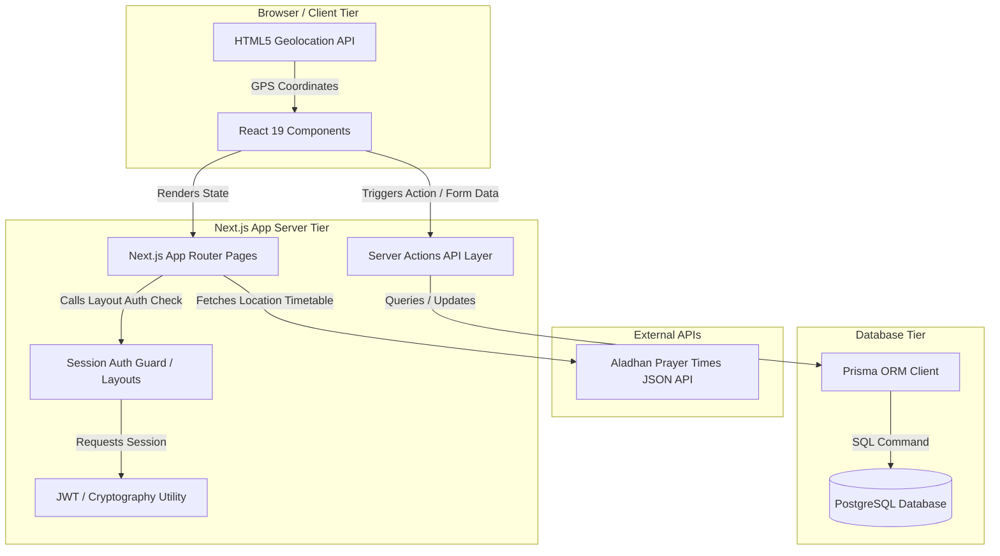
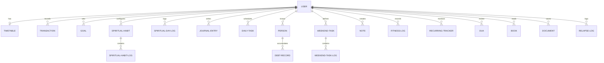
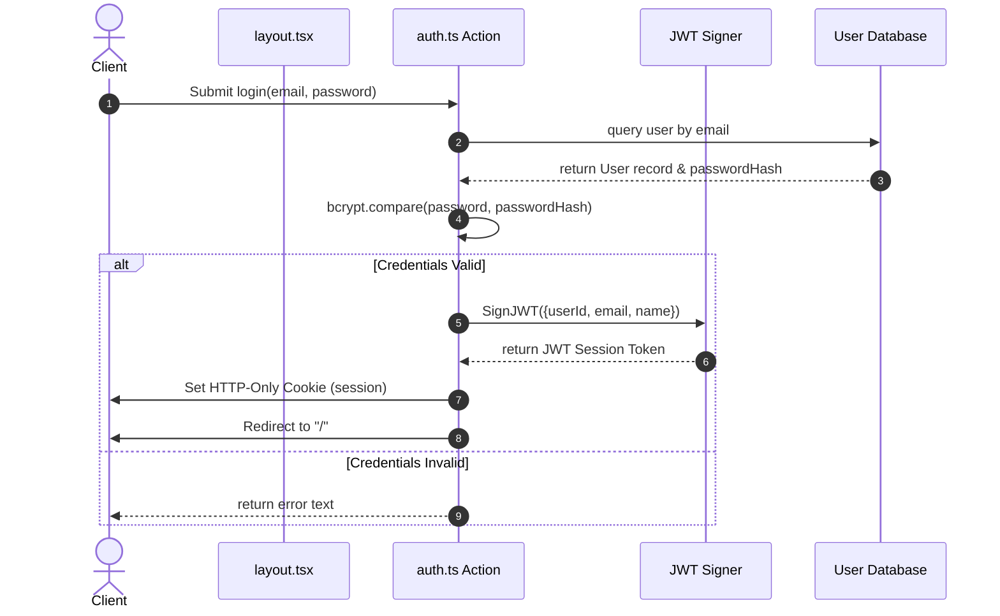
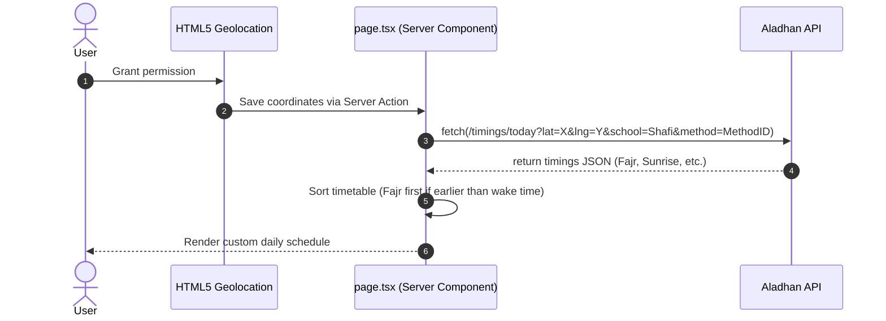

# Detailed System Design Report: Muhasabah

This document outlines the system architecture, database design, data flows, security mechanisms, and integration points of the Muhasabah application.

---

## 1. System Architecture Diagram

---

## 2. Architectural Design Patterns

Muhasabah utilizes a modern Server-Side Rendered (SSR) pattern with server-side page composition and remote procedure call (RPC) data mutations:

1.  **Hybrid Component Rendering:** 
    *   *Server Components (RSC):* Fetch data directly from PostgreSQL via Prisma. They render initial page structures on the server, minimizing layout shifts and eliminating client-side fetch requests.
    *   *Client Components:* Used for pages requiring real-time user interaction, such as modal overlays, calendar selection, input validations, and sliders.
2.  **Server Actions Controller Layer:** Instead of exposing REST endpoints, mutations are declared as server-side functions using the `'use server'` directive. Forms and buttons call these functions directly.
3.  **Path Revalidation:** To update client views without loading state libraries, Server Actions call `revalidatePath('/route')`. This invalidates the Next.js router cache, triggering an automatic UI refresh.

---

## 3. Database Schema & Entity Relationships

The relational database is configured to ensure strict user isolation. All entities reference a parent `User` record with cascade deletions.

### Entity Relationship Diagram (ERD)

### Table Definitions and Schema Highlights

*   **User Isolation:** Relationships link directly to the `User` table via `userId` columns. 
*   **Timezone Safety:** All database logs, creation times, and update times use PostgreSQL's `Timestamptz` type to handle dates across different time zones.
*   **Currency Precision:** Financial values (e.g., in transactions and debt records) are stored using `Decimal(10, 2)` to prevent floating-point rounding errors.
*   **Indices and Constraints:** 
    *   `@@unique([userId, name])` on `SpiritualHabit` prevents duplicate habits for a single user.
    *   `@@unique([habitId, date])` on `SpiritualHabitLog` ensures only one log exists per habit per day.
    *   `@@unique([userId, date])` on `SpiritualDayLog` guarantees a single log entry per day.

---

## 4. Security Framework & Session Flow

Muhasabah uses a custom stateless session validation system rather than external authorization packages.

### Authentication & Authorization Lifecycle

### Key Security Implementations
*   **HTTP-Only Cookies:** The JWT cookie uses the `httpOnly` flag, making it inaccessible to client-side scripts.
*   **Secure Flags:** In production, the cookie is sent only over HTTPS (`secure: true`) and uses `sameSite: 'lax'` to prevent cross-site request forgery (CSRF).
*   **Password Hashing:** Passwords are salted and hashed using `bcryptjs` with a work factor of 10.
*   **Page Boundary Guards:** Main app folders are nested within the `(dashboard)` directory. The root layout of this directory (`layout.tsx`) checks `getAuthenticatedUser()` before rendering child components. If the session cookie is missing or invalid, it redirects the user to `/login` immediately.

---

## 5. Location and Timetable Integration

The daily timetable adjusts to the user's location.

*   **Location Storage:** Geolocation values (`latitude` and `longitude`) are stored on the `User` record.
*   **Astronomical Adjustments:** When coordinates are present, the dashboard fetches current timings from `api.aladhan.com`.
*   **Sorting Logic:** Timetable events are sorted dynamically. If Fajr is calculated to be earlier than the user's wake-up time, the Fajr prayer block is scheduled first; otherwise, the wake-up block is scheduled first.
