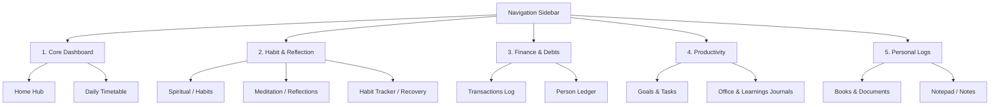
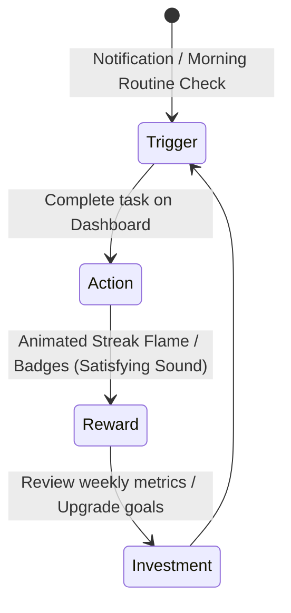

# UI/UX Engineering Audit & Design Improvements: Muhasabah

This report provides a comprehensive review of the Muhasabah interface, detailing design system upgrades, usability enhancements, and gamified features to improve user engagement.

---

## 1. Design System & Theme Customization

While the current gold and charcoal palette (`#bf9129` / `#dcae2e`) fits the name *Muhasabah*, it can feel restrictive. To make the app more appealing to a broader user base, we recommend introducing a dynamic, themeable design system.

### Dynamic Theme Engine
We propose replacing the static color scheme with dynamic theme profiles based on HSL color mapping:

| Theme Name | Hue / Primary | Accent Gradient | UI Vibe |
| :--- | :--- | :--- | :--- |
| **Obsidian Gold** (Current) | `HSL(43, 65%, 45%)` | Gold-to-Mustard Gradient | Premium, Traditional |
| **Emerald Forest** | `HSL(142, 70%, 29%)` | Mint-to-Deep Green | Calm, Focus, Growth |
| **Cobalt Deep** | `HSL(221, 83%, 53%)` | Indigo-to-Blue Gradient | Technical, Professional |
| **Rose Slate** | `HSL(340, 75%, 65%)` | Crimson-to-Rose Gradient | Soft, Reflective, Warm |
| **Minimalist Silver** | `HSL(210, 10%, 40%)` | Dark-to-Light Grey Gradient | Distraction-free |

### CSS Custom Properties Architecture
By refactoring the root variables in `globals.css` to use relative HSL values, users can change the entire UI theme with a single CSS class toggle:

```css
:root {
  /* Set base HSL values */
  --theme-h: 221;
  --theme-s: 83%;
  --theme-l: 53%;

  /* Derivates dynamically calculated */
  --c-primary: hsl(var(--theme-h), var(--theme-s), var(--theme-l));
  --c-primary-container: hsl(var(--theme-h), var(--theme-s), 96%);
  --c-primary-glow: hsla(var(--theme-h), var(--theme-s), var(--theme-l), 0.15);
}
```

---

## 2. Sidebar Navigation & Layout Redesign

The current sidebar contains **16 flat navigation items** in a single list:

```text
Dashboard, Spiritual, Dua, Timetable, Goals, Tasks, Career, Office, Habit Tracker, Fitness, Finances, Ledger, Books, Documents, Notes, Miscellaneous
```

### The Problem: Decision Fatigue & Cognitive Load
A single, flat list of 16 options overwhelms users, making the interface feel cluttered and complex.

### The Solution: Grouped Collapsible Accordions
We recommend grouping related pages into categories:



This structural layout organizes the sidebar, hiding lesser-used features while keeping the core dashboard easily accessible.

---

## 3. Dashboard Information Architecture (IA)

The current dashboard displays all cards in a static grid, showing everything at once.

### The Solution: Modular Tabbed Dashboards
We recommend grouping widgets into tabs to help users focus on one area at a time:

*   **Focus Tab (Daily Task List):** Displays the current calendar timeline, today's checklist, and the quick notes widget.
*   **Habits Tab:** Shows the daily habit matrix and streak logs.
*   **Wealth & Health Tab:** Displays financial expense summaries alongside workout stats.

```text
+-------------------------------------------------------------+
| Muhasabah Home                                              |
| [ Focus Mode ]     [ Habits & Streaks ]     [ Wealth/Health ] |
+-------------------------------------------------------------+
|                                                             |
|   Today's Schedule Progress Line:                           |
|   Wake Up (06:00) ---- [Current: Work] ---- Bedtime (22:30)  |
|                                                             |
|   +--------------------------+   +-----------------------+  |
|   | Today's Checklist        |   | Quick Log Widgets     |  |
|   | [ ] 08:30 Check-in       |   | ( + Expense )         |  |
|   | [ ] Submit proposal      |   | ( + Workout )         |  |
|   | [ ] Drink 2L water       |   | ( + Note )            |  |
|   +--------------------------+   +-----------------------+  |
+-------------------------------------------------------------+
```

---

## 4. Hooking the User (Gamification & Engagement)

To encourage daily use, Muhasabah should provide immediate, satisfying feedback for completed tasks.



### Implement a Streaks Engine
*   **Streak Indicators:** Display a flame icon next to the user profile avatar showing consecutive active days.
*   **Activity Heatmaps:** Add a visual contribution calendar (similar to GitHub's commit graph) for habit logs to make daily progress feel rewarding.
*   **Satisfying Animations:** Trigger subtle micro-animations (e.g., confetti or gradient glows) when a habit or checklist is completed.

### Quick-Log Floating Action Button (FAB)
Instead of forcing users to navigate to separate pages to log an expense or workout, add a global floating action button to the bottom corner. Clicking the button opens a quick modal to log details instantly.

---

## 5. Modern UI Polish (Glassmorphism & Micro-Interactions)

To elevate the app's visual style, we recommend several CSS enhancements:

*   **Elevate Glassmorphism:** Use `backdrop-filter: blur(20px)` and soft border accents to create floating card layers.
*   **Interactive Hover Effects:** Add scale transitions (`transform: translateY(-4px)`) and soft glows using colored shadows when users hover over cards.
*   **Loading State Skeletons:** Use animated skeleton loaders during server-side data fetches to keep the transition smooth.
*   **Progressive Micro-Interactions:** Animate checkboxes (e.g., a checkmark drawing path) and slider handles to make inputs feel responsive.
